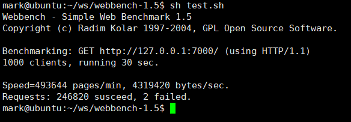
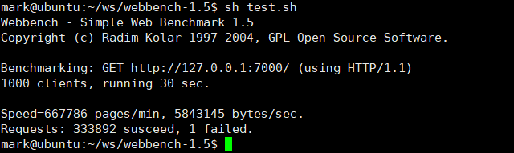

# WebServer

## 项目介绍
本项目是C++11编写的WebServer，支持 HTTP GET 请求，支持静态资源请求，支持 HTTP 长连接。

## 项目环境
* OS: Ubuntu 20.04
* Complier: g++ 10.3

## 构建
```bash
cd ws
mkdir build
cd build
cmake .. && make
```

## 运行
```
./webserver -t 4 -p 7000 -r . -d
```
* -t thread nums, \[default: cpu cores]

* -p port, \[default: 7000]

* -r root directory, \[default: .]

* -d enable damon mode, \[default: off]

所有参数都可以省略，因为都有默认参数。

## 项目技术点
* 使用 epoll + non-blocking IO + ET + Reactor 网络并发模型
* 使用多线程技术充分利用多核CPU, 使用线程池避免频繁创建销毁线程的开销
* 采用 priority queue 实现的小根堆管理定时器，采用标记删除，定期处理超时连接，提高并发
* epoll 使用 EPOLLONESHOT 保证一个连接只被一个线程处理
* 使用 shared_ptr, weak_ptr 管理资源，减少内存泄漏的可能性，采用 RAII 编程机制

## 并发模型设计
### 模型选择
并发模型为 Reactor + non-blocking IO + ThreadPool, 主线程只用于 accept 新连接，如果fd上可读数据被触发，那没返回就绪events给线程池中的IO线程处理。accept为循环检测并返回。
### 线程池
根据本机 CPU cores 数目创建固定数量的线程，充分利用多核CPU的特性。线程池采用 FIFO 的方式分发任务队列的任务，并唤醒一个线程处理任务。线程池的关闭采取优雅关闭模式，唤醒所有线程并等待所有线程处理完毕后，关闭线程池。
### 定时器
采用 STL priority_queue实现 连接时间的管理，底层使用小根堆，采用标记删除，惰性删除的管理方式，当定时器时间结束后，并不会立即关闭超时连接，而是等每次epoll_wait()返回循环末尾统一处理超时连接，此种不严格的超时控制方案，会随着并发的提高而提高检测频率，随着并发减少而降低检测频率，可以动态回收fd。

## 压力测试
采用开源的 Webbench 进行压力测试.

1、默认模式，有 stdout

QPS: 8.2



2、以守护模式运行，无 stdout

QPS：11.1




